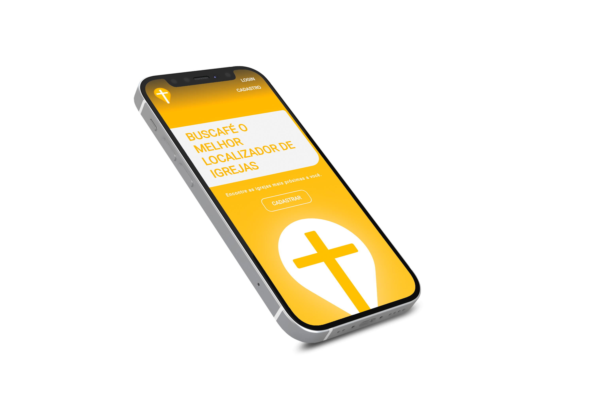

<h1 align="center">
   
    
   
  Buscafé
   
</h1>

<h4 align="center">Find the churches closest to you</h4>

  
  
  

  
   
  Mobile Buscafé

## Key Features

* Find the best church for you
* Participate in to yours churchs activery
* Manage your church, events, infos and better communicate with your members
* Using Google maps API to build our own locator
* Real-time social chats for churches and their members

  

