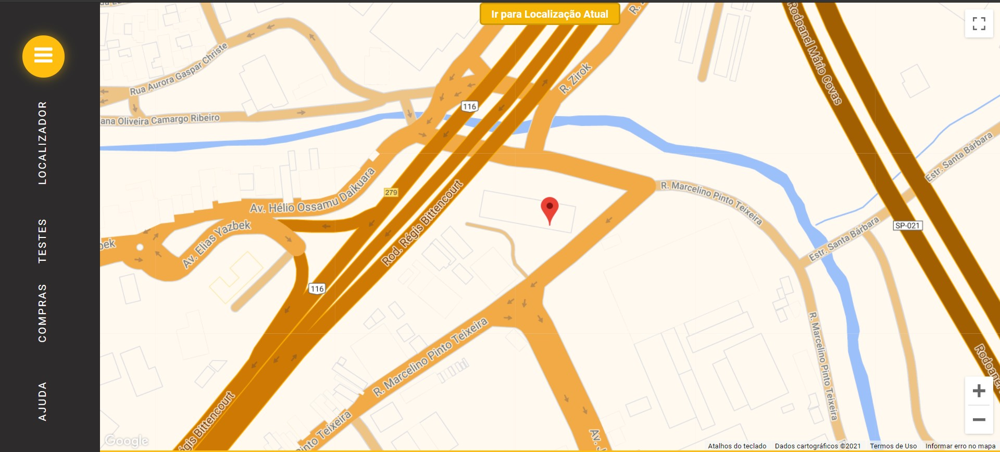
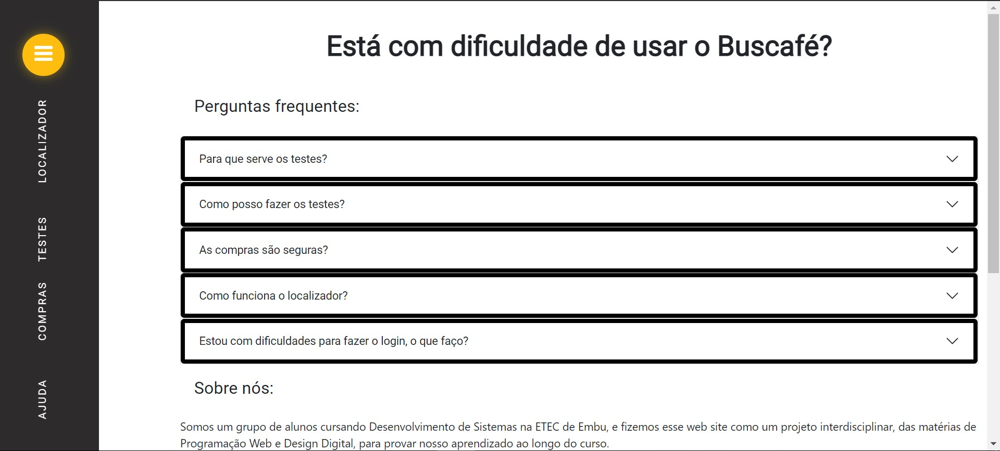

# Buscafé 

Desenvolvimento do localizador de igrejas, Buscafé.

## Sobre Nós
Somos um grupo de alunos cursando Desenvolvimento de Sistemas na ETEC de Embu, e fizemos esse web site como um projeto interdisciplinar, das matérias de Programação Web e Design Digital, para provar nosso aprendizado ao longo do curso.

## Nossa Equipe de Desenvolvimento
* [Igor Braz](https://github.com/Igorcbraz)
* [Gabriel Victor](https://github.com/GabrielVitor1807)
* [Luis Fernando](https://github.com/LuisFernandoPBPereira)

Juntos criamos o [*Buscafé*](https://igorcbraz.github.io/Buscafe/index.html), com o objetivo de direcionar quem procura sua igreja ideal, de forma rápida e prática, assim facilitando o acesso.

## Imagens

